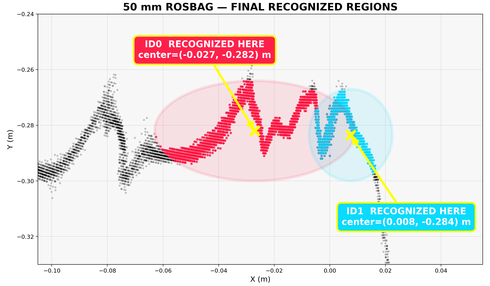
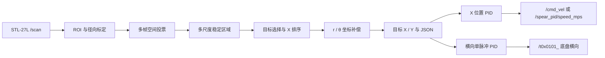

# STL-27L 2D LiDAR Target Tracking

基于 **STL-27L 单层二维激光雷达** 和 **ROS 2 Jazzy** 的多目标识别、X 坐标补偿与位置外环 PID 项目。

项目从真实 `LaserScan` 中稳定识别 5～6 个目标，按 X 从小到大分配 ID，输出每个目标的二维坐标，并可将指定目标的 X 位置误差转换成限幅速度指令。



## 功能概览

- STL-27L ROS 2 驱动，兼容 Ubuntu 24.04 / ROS 2 Jazzy
- 多帧二维网格投票，抑制单帧噪声和无效回波
- 5 mm、3 mm、2 mm 多尺度候选分离
- 固定目标数量、近似共线和间距结构评分
- 径向距离标定和 X 精度优先的极坐标补偿
- 5 个或 6 个目标按 X 递增稳定编号
- rosbag 离线分析、JSON 结果保存和 RViz 可视化
- X 位置外环 PID，输出 `/cmd_vel` 与标量速度
- 触发式横向单脉冲 PID，输出 `/t0x0101_` 底盘控制指令
- ARES R2 Tool 对接机构 ROS2 控制封装（`README_CONTROL.md`）
- 10 组真实 MCAP rosbag、真值表和实验媒体

## 当前结果

| 项目 | 当前状态 |
|---|---|
| 目标数量 | 支持 5 / 6 个目标 |
| 工作区域 | 雷达 `-Y` 一侧，约 0.03～0.43 m |
| 编号方式 | 沿排列轴按 X 从小到大 |
| 优先精度 | 当前以 X 精度为主要验收指标 |
| 五目标验证 | 一组真值测试 X 平均绝对误差约 6.3 mm |
| 六目标验证 | 独立包中 5/6 个目标 X 误差不超过 10 mm |
| 自动测试 | 22 项通过 |
| 速度控制 | 安全限幅的 X 位置外环 PID 原型 |

这些精度只对应当前雷达、安装结构、目标形状和标定数据。更换硬件或机械布置后必须重新标定。

## 系统流程



## 仓库结构

```text
.
├── README.md
├── docs/                         项目文档
│   ├── assets/                   实验图片和视频
│   ├── calibration.md            标定过程与参数
│   ├── driver.md                 STL-27L 驱动说明
│   ├── exam-result.md            历史盲测结果
│   ├── pid-control.md            PID 使用与安全说明
│   ├── processing.md             识别算法和 ROS 接口
│   ├── project-memory.md         完整开发与实验记录
│   └── recognition-results.md    识别和精度结果
├── datasets/                     真实 rosbag、场景信息和真值表
├── scripts/                      录制、分析、回放与渲染工具
└── src/
    ├── ldlidar_stl_ros2/         已包含兼容修补的厂商驱动
    └── spear_locator/            识别、标定补偿和 PID ROS 2 包
```

文档导航见 [docs/README.md](docs/README.md)，数据说明见 [datasets/README.md](datasets/README.md)。

## 环境要求

- Ubuntu 24.04
- ROS 2 Jazzy
- Python 3.12
- `colcon`
- STL-27L，串口波特率 `921600`

## 安装与构建

```bash
git clone git@github.com:seven-teen123/2d-lidar.git
cd 2d-lidar

# 兼容现有脚本使用的 data/ 路径
ln -s datasets data

source /opt/ros/jazzy/setup.bash
colcon build --symlink-install
source install/setup.bash
```

运行测试：

```bash
pytest -q src/spear_locator/test
```

## 连接并启动雷达

先确认串口：

```bash
ls -l /dev/ttyUSB* /dev/ttyACM*
```

USB 接口变化后设备可能从 `/dev/ttyUSB0` 变成 `/dev/ttyUSB1`。启动雷达和 RViz：

```bash
ros2 launch ldlidar_stl_ros2 viewer_stl27l.launch.py \
  port_name:=/dev/ttyUSB1
```

如果没有串口权限：

```bash
sudo usermod -aG dialout "$USER"
```

执行后注销并重新登录。

## 在线识别

识别 5 个目标：

```bash
ros2 launch spear_locator recognition_viewer.launch.py \
  expected_count:=5
```

识别 6 个目标：

```bash
ros2 launch spear_locator recognition_viewer.launch.py \
  expected_count:=6
```

查看 JSON 输出：

```bash
ros2 topic echo /spear_recognition/result
```

输出包含：

- 目标 ID
- 补偿后的 `x_m`、`y_m`
- 补偿前稳定区域中心
- 目标区域跨度
- 排列直线和相邻间距指标

## 处理已有 rosbag

直接分析五目标数据：

```bash
ros2 run spear_locator analyze_bag \
  datasets/bags/five_targets_0mm_r8_20260620_162610/bag \
  --expected-count 5
```

一键分析、保存 JSON、循环回放并打开 RViz：

```bash
./scripts/process_and_view_bag.sh \
  datasets/bags/five_targets_0mm_r8_20260620_162610 5
```

## 录制新数据

确保 `/scan` 正常发布后：

```bash
./scripts/record_scene.sh five_targets 0 20 1 5
```

参数依次为：

```text
场景名称  真值距离占位  录制秒数  重复编号  目标数量
```

## X 位置 PID

PID 订阅 `/spear_recognition/result`，让指定目标稳定在期望 X 位置。

先只观察，不驱动：

```bash
ros2 launch spear_locator position_pid.launch.py \
  target_id:=2 desired_x_m:=0.0 enabled:=false
```

查看状态和速度：

```bash
ros2 topic echo /spear_pid/status
ros2 topic echo /spear_pid/speed_mps
```

确认机械运动方向后再启用：

```bash
ros2 launch spear_locator position_pid.launch.py \
  target_id:=2 desired_x_m:=0.0 enabled:=true
```

默认最大速度为 `0.01 m/s`，每次新测量只保持 0.5 秒；识别失败或超时会自动归零。实际连接运动机构前请阅读 [PID 安全说明](docs/pid-control.md)。

## 横向单脉冲 PID

触发式横向控制，每次触发选择 X 最接近 0 的矛头，发出一个固定时长（默认 0.5s）的横向速度脉冲。

启动节点：

```bash
ros2 launch spear_locator lateral_pid.launch.py
```

**预览（不实际驱动）：**

```bash
python3 scripts/check_lateral_pid.py
```

输出所有目标位置、自动选择的最近目标、以及触发后实际会发送的速度指令。

**触发一次脉冲：**

```bash
python3 scripts/trigger_lateral_pid.py
```

查看状态：

```bash
ros2 topic echo /lateral_pid/status
```

**关键参数（`config/lateral_pid.yaml`）：**

| 参数 | 默认值 | 说明 |
|---|---|---|
| `kp` | 0.2 | 比例增益 |
| `minimum_speed_mps` | 0.02 | 底盘最小响应速度 |
| `maximum_speed_mps` | 0.1 | 最大安全速度 |
| `deadband_m` | 0.005 | X 位置死区 |
| `command_hold_s` | 0.5 | 单次脉冲时长 |
| `direction_sign` | 1.0 | 方向符号，设为 -1 反转 |

**工作流程：**

```
IDLE ──(trigger)──> 选 |X| 最小目标 → PID 计算速度 → 发脉冲 0.5s → 归零 → IDLE
```

每次触发只执行一次脉冲，需多次触发逐步收敛。可用 `check_lateral_pid.py` 先预览再触发。

## 数据集

`datasets/bags/` 包含：

- 2 组五目标数据
- 8 组六目标或调试数据
- 每组的 `scene.md`
- rosbag `metadata.yaml`
- 可用场景的 `recognition_result.json`
- 真值表 `datasets/data_contract.ods`

其中部分数据是被明确排除的调试场景，例如目标数量不足或目标与环境重叠。是否可用于标定应以场景说明和 [识别结果文档](docs/recognition-results.md) 为准。

## 重要文档

- [识别与精度结果](docs/recognition-results.md)
- [标定方法与参数](docs/calibration.md)
- [识别算法与 ROS 接口](docs/processing.md)
- [STL-27L 驱动说明](docs/driver.md)
- [PID 控制与安全](docs/pid-control.md)
- [完整项目记忆](docs/project-memory.md)

## 注意事项

- 当前主要优化 X 精度，Y 坐标仍输出，但暂不作为主要验收指标。
- 2D 雷达只能直接测量扫描平面内的位置，不能独立测量三维高度。
- 目标表面回波中心不等于机械中心，当前补偿依赖特定目标形状和观察角度。
- PID 是位置外环，实际电机仍应具有速度或电流内环以及独立的命令超时保护。
- 不要同时运行真实雷达驱动和 rosbag 回放，否则两者会同时发布 `/scan`。

## License

厂商驱动保留其原始许可证，见 [src/ldlidar_stl_ros2/LICENSE](src/ldlidar_stl_ros2/LICENSE)。项目其余代码目前未单独声明开源许可证。
